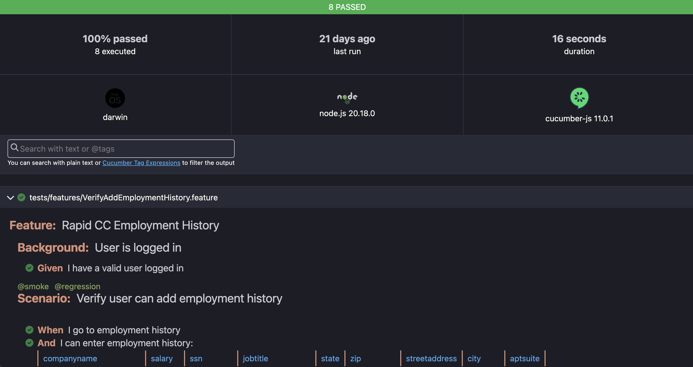

<br>
We leveraged <b>Playwright 1.48.2</b> with <b>Cucumber-js 11.0.1</b> for our test automation. The scenarios can be run in parallel and using tags. The project uses a page object model with API helpers to do data setup and teardown when needed. JSON and HTML reports are produced after the tests are run and are located in the results directory.
<br><br>

* For load/soak testing approach and results, click <a href="https://github.com/REI-Systems/REISystems-OGST-USCIS-RAPID-Coding-Challenge-Document-Library/blob/main/Testing/Soak%20Testing.md">here</a>.
* For 508 accessibility testing approach and results, click <a href="https://github.com/REI-Systems/REISystems-OGST-USCIS-RAPID-Coding-Challenge-Document-Library/blob/main/Testing/508%20Accessibility.md">here</a>.

### Why Playwright?

<a href="https://playwright.dev">Playwright</a>$\textcolor{silver}{↗}$ is an open-source automation library for browser testing and web scraping developed by Microsoft and launched in 2020 (built by the same team that created Puppeteer), designed from the ground up for modern web applications and has since become popular among programmers and web developers.

Benefits of Playwright:
* **Parallel testing**: Supports the execution of simultaneous tests through Browser Context. This scales up testing and comes in handy when multiple web pages must be tested simultaneously.
* **Advanced features**: Offers advanced features like automatic waiting, network interception, and support for multiple pages/tabs. It also provides a Trace Viewer for debugging.
* **Ease of use**: Requires NodeJS and is relatively easier to install than Selenium.

<br>
<hr>


## Our Approach

The cucumber report is automatically generated after the tests run.  It is located in the results directory in the root of the project.  The test framework will automatically generate the html report and json report which can be used as artifacts.

The report has the summary at the top with expandable details below it for each feature and scenario it runs.
<br>



<br>


<br>
<hr>

## Installation

The playright browser tests can be run in terminal locally against dev with the following commands:

```npm ci```

## Usage

To run the tests locally:

To specify an environment use the env parameter
```env=dev npx cucumber-js test --tags '@regression```

See the <a href="package.json">package.json</a> script for more runtime options.

### GitHub Actions

The <a href=".github/workflows/playwright.yml">playwright.yml</a> file in the .github/workflows/ directory is used within the GitHub repository for this project to tell GitHub actions which tests to run and what to do with the results. Currently it is setup to run the smoke tests in parallel with 3 threads. GitHub Actions will trigger and run the tests when a PR is created or when branches are merged. They can be run manually within GitHub Actions as well.


